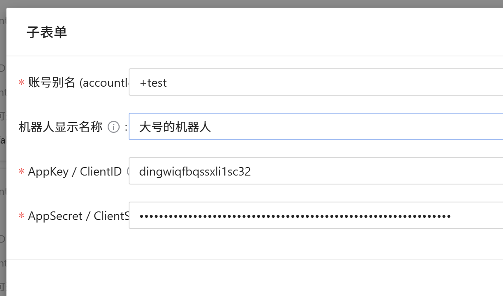

## Yunzai-plugin-Dingtalk 
[](https://hits.seeyoufarm.com)
[]()

## 适用于 TrssYunzai的钉钉机器人适配器


### 使用本仓库地址
```
git clone --depth=1 https://github.com/XuF163/Yunzai-plugin-Dingtalk.git ./plugins/Ding-plugin  
```  
 
### 国服  

```
git clone --depth=1 https://ghcdn.042999.xyz/https://github.com/XuF163/Yunzai-plugin-Dingtalk.git ./plugins/Ding-plugin
```
### 依赖

```
cd plugins/Ding-plugin && pnpm i
```
### 配置  
  参阅[钉钉开发者后台](https://open-dev.dingtalk.com) ,选择stream格式；

### 效果演示  

| 私聊                                                                                                  | 群聊                                                                                                  |
|-----------------------------------------------------------------------------------------------------|-----------------------------------------------------------------------------------------------------|
|  |  |


参考配置实例：  
  
如果你没有使用代理的需求，则无需手动配置webhook  
TODO 
- [x] 群/私聊场景下的图文收发
- [x] 多账号支持
- [x] 支持锅巴面板配置
- [x] 图片(如果没有其它具备图片上传能力的机器人存在则需要使用公网环境)
- [ ] 图床支持
- [ ] 主动消息  


### 免责声明
本插件仅供学习交流使用，转载请注明来源。  
本仓库存在不代表作者认可任意与本仓库可能存在关联的任意第三方仓库的行为及价值观。  
因使用本插件导致的任何问题，作者概不负责。


### 许可协议  
本仓库使用APGL3开源协议，如你进行了修改并将其作为网络服务提供，你必须主动公开并向最终用户提供这些修改的源代码且不得扭曲或隐藏本仓库免费且开源的事实。  

### 参考仓库
- 本项目在开发过程中可能浏览、参考、部分引用甚至完全照搬了以下仓库的代码或设计，感谢相关组织和个人的贡献。  
基本SDK来自:  
https://github.com/open-dingtalk/dingtalk-stream-sdk-nodejs  
框架及现有适配器参考以下项目：  
https://github.com/TimeRainStarSky/Yunzai  
https://gitee.com/TimeRainStarSky/Yunzai-QQBot-Plugin  
https://gitee.com/xiaoye12123/ws-plugin  
https://github.com/Zyy955/Lain-plugin  
guoba.support.js编写参考以下项目：  
https://github.com/erzaozi/waves-plugin    
https://github.com/guoba-yunzai/guoba-plugin 
